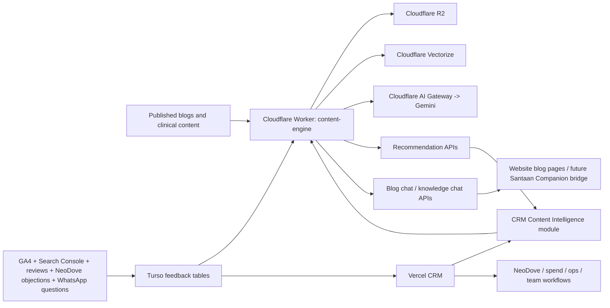

# Santaan CRM 2.0 Cloudflare Content Engine Architecture
Date: March 11, 2026
Status: Approved architecture plan
Owner: Santaan Growth OS / CRM 2.0

## 1. Objective
Build an adaptive content intelligence plane on Cloudflare that powers Santaan CRM 2.0 without disturbing the current live CRM on Vercel.

The content plane will handle:
- blog/content ingestion
- chunking + embedding
- semantic retrieval
- internal link recommendations
- content opportunity ranking
- grounded blog/community chat
- AI generation orchestration
- feedback-loop computation from GA4, Search Console, reviews, NeoDove objections, and WhatsApp questions

The current CRM will remain responsible for:
- authentication and role access
- CEO dashboard and action views
- spend / ROI / ops / reviews / content module UI
- NeoDove operational integration
- human workflow and approvals

## 2. Strategic decision
### Keep on Vercel now
Keep the existing CRM on Vercel during CRM 2.0 rollout.

Reason:
- the CRM is already functional
- auth and operational dashboards are already wired
- moving the whole app first would create migration risk without solving the actual content/RAG gap

### Build a parallel Cloudflare plane
Build a separate service plane on Cloudflare and connect it to CRM through APIs.

Reason:
- clean isolation of new AI/RAG concerns
- lower release risk
- easier phased rollout
- future option to migrate more of the stack if justified

## 3. Target architecture

## 4. Product boundaries
### Vercel CRM responsibilities
- `Content Intelligence` UI
- approvals / editors / role access
- content asset registry
- content feedback intake
- review management
- CEO Command and Analytics
- NeoDove and operations

### Cloudflare content-engine responsibilities
- ingest and normalize content text
- chunk content
- generate/store embeddings
- retrieve relevant historical content
- compute internal link recommendations
- compute next-topic / refresh recommendations
- support grounded chat responses for blogs/knowledge
- optionally generate structured draft artifacts for future HITL publishing

## 5. Core Cloudflare services
### 5.1 Worker: `santaan-content-engine`
Primary API/orchestration service.

Responsibilities:
- ingestion endpoints
- chunk + embed jobs
- retrieval endpoints
- recommendation endpoints
- analytics feedback aggregation endpoints
- blog chat endpoint

Recommended routes:
- `POST /ingest/article`
- `POST /ingest/feedback`
- `POST /recommend/internal-links`
- `POST /recommend/topics`
- `POST /recommend/refresh`
- `POST /chat/blog`
- `GET /health`

### 5.2 R2 buckets
Recommended buckets:
- `santaan-content-drafts`
- `santaan-content-assets`
- `santaan-content-media`
- `santaan-content-chat-cache` (optional)

Use cases:
- source markdown
- structured draft JSON
- generated images/video/audio metadata
- prompt traces or approved artifacts if needed

### 5.3 Vector layer
Recommended first implementation:
- Cloudflare Vectorize

Why:
- higher control for CRM-grade recommendation logic
- better metadata filtering for center / audience / content type
- easier custom ranking later

Index recommendation:
- `santaan-content-index`

Embedding strategy:
- paragraph-level chunks
- include metadata:
  - asset id
  - asset type
  - center
  - audience
  - funnel stage
  - primary keyword
  - publish date

### 5.4 AI Gateway
Use AI Gateway in front of Gemini.

Purpose:
- logging
- rate limits
- caching
- provider control
- auditability for CRM 2.0 AI usage

### 5.5 Turso
Turso remains the shared metadata/state database.

Use Turso for:
- content asset metadata
- feedback signals
- recommendation snapshots
- retrieval logs (if needed)
- approval state
- analytics summary snapshots

Do not move primary CRM data stores in phase 1.

## 6. Data model extensions
### 6.1 Existing CRM tables remain
Current CRM already has:
- content asset registry
- content feedback
- reviews
- spend
- ops input
- contacts

### 6.2 New Cloudflare-facing logical entities
Add these as new tables or logical payload contracts when implementation starts:

#### `content_chunks`
- `id`
- `asset_id`
- `chunk_index`
- `section_label`
- `text`
- `token_count`
- `r2_path`
- `created_at`

#### `content_embeddings`
- `id`
- `asset_id`
- `chunk_id`
- `vector_provider`
- `vector_index`
- `metadata_json`
- `created_at`

#### `content_recommendations`
- `id`
- `recommendation_type` (`internal_link`, `next_topic`, `refresh`, `faq`, `reel_angle`)
- `asset_id`
- `source_signal_json`
- `recommendation_json`
- `status`
- `created_at`
- `reviewed_at`

#### `content_signal_snapshots`
- `id`
- `signal_type` (`ga4`, `search_console`, `review_theme`, `neodove_objection`, `whatsapp_question`, `social_feedback`)
- `signal_date`
- `payload_json`
- `created_at`

## 7. API contract between CRM and Cloudflare
### CRM -> Cloudflare
#### `POST /ingest/article`
Purpose:
- push or refresh a published article into the vector pipeline

Payload:
- `assetId`
- `title`
- `url`
- `type`
- `center`
- `audience`
- `funnelStage`
- `primaryKeyword`
- `secondaryKeywords`
- `publishedAt`
- `contentMarkdown`

#### `POST /ingest/feedback`
Purpose:
- send normalized content demand signals

Payload:
- `source`
- `priority`
- `center`
- `theme`
- `summary`
- `linkedAssetId`
- `rawContext`

#### `POST /recommend/internal-links`
Payload:
- `assetId`
- `draftText`
- `center`
- `audience`

Return:
- top recommended prior links with anchor suggestions and rationale

#### `POST /recommend/topics`
Payload:
- `center`
- `audience`
- `lookbackDays`
- optional filters

Return:
- ranked topic list
- target format suggestion
- source evidence

#### `POST /chat/blog`
Payload:
- `assetId`
- `question`

Return:
- grounded answer
- citations
- fallback if unsupported by context

### Cloudflare -> CRM
Cloudflare should return structured JSON only.
No HTML rendering responsibility should live there in phase 1.

## 8. Retrieval and RAG strategy
### Chunking
Default:
- paragraph-first chunking
- preserve heading hierarchy
- store section labels
- merge undersized chunks

### Retrieval
Top-K retrieval with metadata filters:
- center-aware when relevant
- audience-aware when relevant
- exclude same asset when finding internal links

### Recommendation outputs
#### Internal links
- `source_section`
- `target_asset_id`
- `target_title`
- `target_url`
- `anchor_text`
- `why`

#### Topic recommendations
- `suggested_title`
- `suggested_format`
- `suggested_audience`
- `suggested_center`
- `reason`
- `evidence`

## 9. Feedback loop sources
### Phase 1 sources
- CRM content assets
- CRM content feedback
- CRM review themes
- GA4 top content pages already partially integrated

### Phase 2 sources
- Search Console query data
- NeoDove objection patterns
- counselor notes
- WhatsApp FAQ clusters
- social performance import/API

## 10. Security model
### Authentication between systems
Use server-to-server bearer secret between Vercel CRM and Cloudflare Worker.

Recommended envs:
- `CF_CONTENT_ENGINE_URL`
- `CF_CONTENT_ENGINE_TOKEN`

### Role model
Cloudflare service does not own Santaan user roles.
It trusts only CRM backend calls or tightly scoped public chat endpoints.

### Public chat controls
For `talk-to-this-blog`:
- grounded answers only
- no cost claims
- no success-rate claims
- no patient-specific medical advice
- route to Santaan executive for pricing and personalized treatment questions

## 11. Release phases
### Phase 0: contract and infra prep
- finalize schema and API contract
- create Worker, R2, Vectorize, AI Gateway
- create secrets and environments

### Phase 1: ingestion + retrieval
- ingest existing patient blogs and clinical insights
- chunk + embed all published content
- return related-content recommendations

### Phase 2: CRM recommendation integration
- wire `Content Intelligence` to Cloudflare APIs
- show internal-link suggestions
- show next-topic recommendations
- show refresh candidates

### Phase 3: adaptive feedback loop
- add GA4 + Search Console + review themes + NeoDove objection signals
- rank content opportunities by demand and business relevance

### Phase 4: grounded blog chat
- deploy `talk-to-this-blog`
- add citations and safety guardrails
- log unanswered topic gaps back into CRM feedback queue

### Phase 5: HITL generation (optional)
- generate structured draft suggestions
- keep approval inside CRM
- no auto-publish in first release

## 12. Success criteria
Phase 1 success:
- all published blogs indexed
- related-content suggestions work with acceptable relevance

Phase 2 success:
- content team can see next-topic and internal-link recommendations in CRM

Phase 3 success:
- CRM begins surfacing adaptive topic ideas from real demand signals

Phase 4 success:
- blog chat gives grounded answers with source links and safe fallbacks

## 13. Explicit non-goals for first release
- full CRM migration off Vercel
- full content generation autopilot
- automatic social publishing
- video generation orchestration
- replacing Santaan Companion immediately

## 14. Recommendation
Proceed with a hybrid model:
- Vercel for CRM command layer
- Cloudflare for content intelligence plane
- Turso as shared metadata state

This is the lowest-risk, highest-control path for Santaan CRM 2.0.
