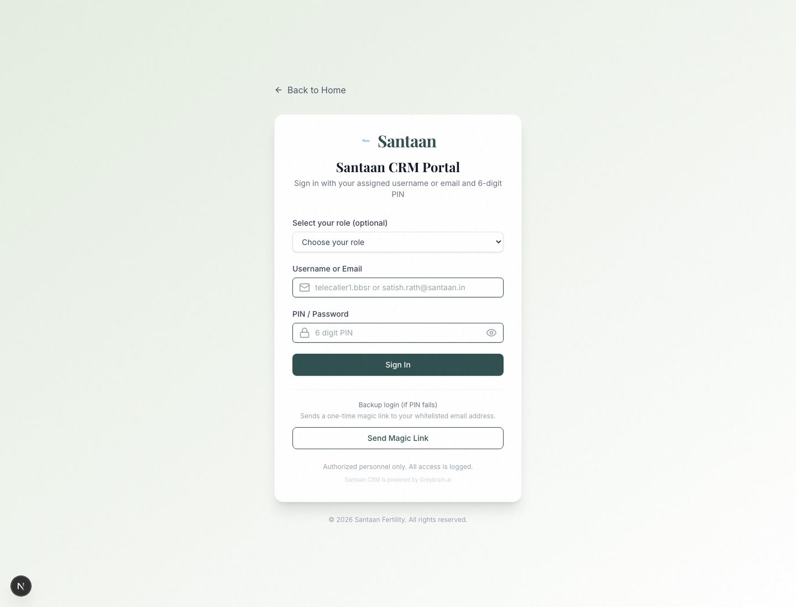
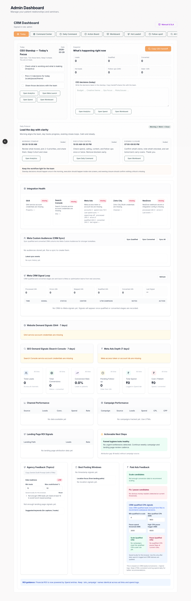
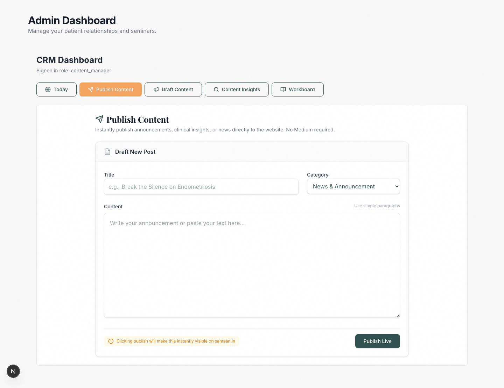
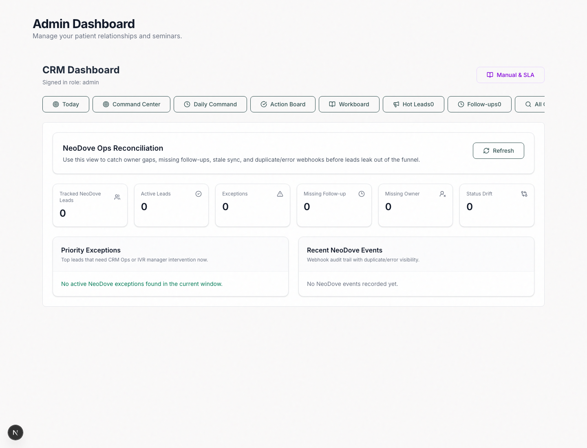
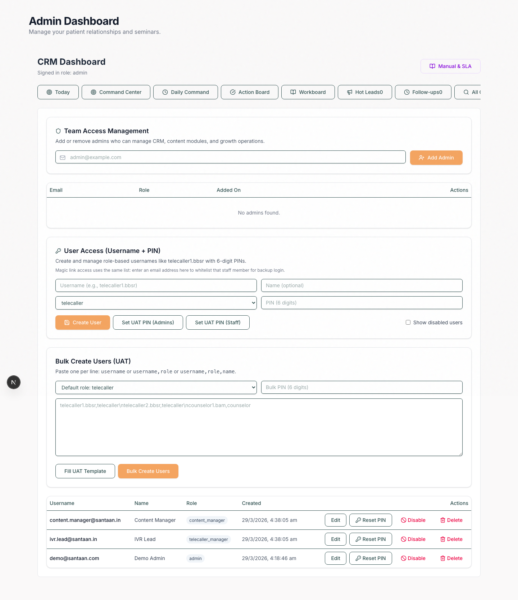

# Santaan CRM Visual Onboarding Manual (March 28, 2026)

This guide is the fast, visual version of the Santaan CRM manual. It is meant for onboarding team members who need to learn the portal by looking at the real screens.

## Who This Is For

- CEO / leadership
- content team
- telecaller managers
- telecallers and counselors
- admins onboarding new users

## 1. Login Screen

Use the login page at `santaan.in/login`.

What to do:

1. Select your role if it appears in the dropdown.
2. Enter your username or email.
3. Enter your 6-digit PIN.
4. Click `Sign In`.

Backup path:

- use `Send Magic Link` only if your email is whitelisted

## 2. Start Here Every Morning: Today Tab

The `Today` tab is the home screen for the day.

Use it to:

- read the rider or daily checklist
- open the next correct tab
- review today’s priorities
- see snapshot numbers quickly

For leadership, the `Today` screen gives:

- the standup checklist
- quick actions to Analytics, Spend, and Workboard
- a daily operating rhythm
- integration health cards

## 3. Publish Content From The CRM

Content is now published directly from the portal.

Use `Publish Content` when you need to put something live on the website without waiting for a separate publishing flow.

Steps:

1. Open `Publish Content`.
2. Add a title.
3. Choose the right category.
4. Paste the content.
5. Click `Publish Live`.

Use this for:

- news and announcements
- clinical insights
- doctor updates

## 4. NeoDove Ops Screen

This is the control screen for the calling sync.

Use `NeoDove Ops` to catch:

- missing owners
- missing follow-ups
- stale sync
- webhook issues
- status drift between NeoDove and CRM

When the wiring is healthy, this screen helps managers find exceptions before leads leak out.

## 5. User Access Screen

Admins should use `User Access` for onboarding and PIN resets.

This is where you:

- create new staff users
- assign roles
- set 6-digit PINs
- bulk-create users for onboarding
- disable or delete old access

Best use:

- add every new team member here before they start work
- keep roles clean so the right tabs appear automatically

## 6. Role-Based Daily Routine

### CEO / Admin

Morning:

- open `Today`
- review `Command Center`
- check `Analytics` and `Spend`

During the day:

- review `NeoDove Ops`
- remove blockers
- decide only the top few priorities

Evening:

- close out in `Workboard` and `Daily Command`

### Content Manager

Morning:

- open `Today`
- review `Content Insights`

During the day:

- write and publish from `Publish Content`
- coordinate draft and launch items in `Draft Content`

Evening:

- update `Workboard`

### Telecaller Manager / IVR Manager

Morning:

- open `Today`
- check `Action Queue`
- review `NeoDove Ops`

During the day:

- clear `Hot Leads`
- clear `Follow-ups`
- fix owner and follow-up gaps

Evening:

- confirm no important lead is left without next action

### Counselor / Telecaller

Morning:

- open `Today`
- move to `Hot Leads` or `Follow-ups`

During the day:

- call the lead
- update status
- add notes
- set next follow-up

Evening:

- make sure every active lead has a next action

## 7. NeoDove Reality Check

The live-tested NeoDove setup currently supports these workflow events:

- `Lead Created`
- `Call Connected`
- `Call Not Connected`

Important:

- workflows are campaign-specific, not global
- use `Send All Data`
- the webhook URL token must match the CRM secret
- NeoDove notification history should show `200`

## 8. Simple Success Checklist

The CRM is being used correctly when:

- every staff member can log in
- every active lead has a status
- every active lead has a next follow-up
- NeoDove sync returns `200`
- content can be published directly from the CRM
- leadership reviews the same dashboard daily

## 9. Recommended Use In Training

For onboarding new staff:

1. show the login screen
2. show the `Today` tab
3. show only the tabs relevant to that person’s role
4. make them update one sample lead
5. make them set one follow-up
6. make them close one task before ending training

That is enough to make the system usable from day one.
